# GEN-I Recruitment Tasks

This repository contains solutions to three tasks covering hydro production forecasting, electricity price analysis, and price scenario modelling. Data manipulation is done with [Polars](https://pola.rs), classical ML models are built with [scikit-learn](https://scikit-learn.org), and automated model selection with [AutoGluon](https://auto.gluon.ai).

---

## Task 1: Hydro Production Forecast Model

### 1.a: Linear model

We fit a linear relationship between river inflow and daily energy production:

$$y = f(x) = k \cdot x + n$$

where $x$ is river inflow [m³/s] and $y$ is realized daily production [MWh/day].

Coefficients are estimated with **Ordinary Least Squares (OLS)**, unregularised, minimising the sum of squared residuals.

**Results:**

| Parameter | Value |
|---|---|
| k (slope) | 2.4841 MWh/day per m³/s |
| n (intercept) | 1935.09 MWh/day |
| R² (all data) | 0.9135 |

**Predictions:**

| River inflow | Predicted production |
|---|---|
| 4 000 m³/s | 11 871 MWh/day |
| 11 000 m³/s | 29 260 MWh/day |

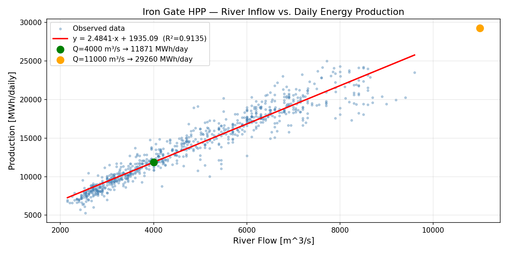

---

### 1.b: Non-linear models

We compare three models on a **chronological 80/20 train-test split**, where the first 80% of days are used for training, the last 20% for evaluation. The split is kept in time order (no random shuffle) because a random split would leak future data into training, giving an overly optimistic picture of how the model would actually perform on unseen future observations:

| Model | Description |
|---|---|
| **Linear** | Baseline OLS straight-line fit |
| **Spline** | Piecewise cubic spline basis (8 knots) + linear regression, captures smooth non-linearity |
| **AutoGluon** | Automated ML, trains and ensembles many model types, selects the best combination |

**Test set metrics:**

| Model | RMSE | MAE | R² |
|---|---|---|---|
| Linear | 1011.6 | 781.3 | 0.9073 |
| Spline | 938.2 | 725.3 | 0.9202 |
| AutoGluon | 887.0 | 693.3 | 0.9287 |

The spline captures the saturation effect at high flows that the linear model misses. **AutoGluon achieves the best performance on the held-out test set**, automatically selecting and ensembling the strongest models found during training.

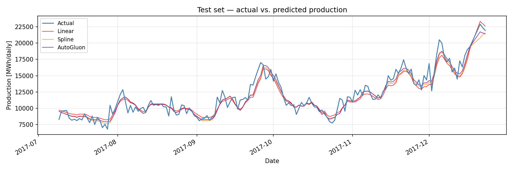

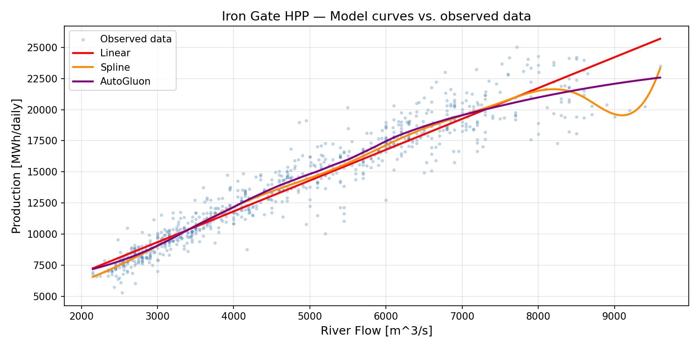

---

### 1.c: Daily forecasting process

The model above uses measured river flow as input, in a real forecasting scenario this isn't known yet, so it needs to be forecast as well. The key inputs would be:

- **Forecasted river flow**: the main driver. Comes from hydrological models fed by weather forecasts (precipitation, temperature, snowmelt).
- **Weather forecasts**: precipitation and temperature drive river flow upstream; temperature also affects demand and plant efficiency.
- **Current river state**: today's measured flow and upstream gauge readings to ground the forecast in the latest observations.
- **Planned outages or constraints**: maintenance windows or grid operator requests that limit production regardless of available flow.
- **Lag features**: since historical values are always known at forecast time, they can be added directly as inputs:
  - Recent production (yesterday, last 3 and 7 days), the plant doesn't jump from one operating regime to another overnight
  - Recent river flow averages (last 3 and 7 days), captures whether the basin is in a wet or drought period, since water already upstream takes time to arrive at the generators

Each day we would pull the latest forecasts, compute the lags from yesterday's actuals, and run the model to get a production estimate for the next few days.

---

### 1.d: Factors influencing electricity prices

**Daily price drivers**

Apart from hydro, the main daily drivers are:

- **Demand**: the most predictable component. Load follows a daily and weekly pattern (morning/evening peaks, low nights and weekends) and is strongly driven by temperature through heating and cooling demand.
- **Gas and coal prices**: because gas plants are often the marginal unit in Central Europe, the gas price effectively sets the electricity price in many hours. CO₂ allowance costs stack on top of this.
- **Wind and solar output**: zero marginal cost, so high renewable generation pushes thermal plants off the stack and pulls prices down. Forecast errors in renewables are the main source of intraday volatility.
- **Cross-border flows**: congestion between price zones can isolate a market and cause local spikes or surpluses that would otherwise be smoothed out by trade.
- **Unplanned outages**: a large thermal or nuclear unit tripping can tighten supply significantly within hours.

**Expected changes**

The direction is fairly clear: more renewables mean lower average prices but wilder swings. Some things I expect in the coming years:

- More hours of zero or negative prices, especially around midday when solar peaks (just like in Germany).
- Sharper price spikes during low-wind, low-solar periods.
- The gap between cheap and expensive electricity is growing, midday power (when solar is abundant) is getting cheaper, while morning and evening power (when solar disappears and everyone uses electricity at once) is getting more expensive
- Batteries and flexible demand (EVs, heat pumps) starting to smooth things out, but probably not fast enough to keep up with the pace of renewable growth in the near term
- Short-term forecasting becoming more valuable for both plant operators and traders, getting the next few hours or days right matters more when prices are volatile

---

## Task 2: Price Value of Electricity

### 2.a: Baseload price, full year and monthly

The **baseload price** is the simple arithmetic mean of all hourly prices in the year calculated as:

```python
# Annual
baseload_annual = df["price"].mean()  # 48.75 €/MWh

# Monthly
monthly_baseload = (
    df
    .with_columns(pl.col("datetime_cet").dt.month().alias("month"))
    .group_by("month")
    .agg(pl.col("price").mean().alias("baseload_€MWh"))
    .sort("month")
)
```

**Annual baseload value 2019: 48.75 €/MWh**

Monthly values vary around this annual average. Prices are higher in winter and softer in spring and autumn when demand is moderate. The chart below shows each month alongside the annual reference line:

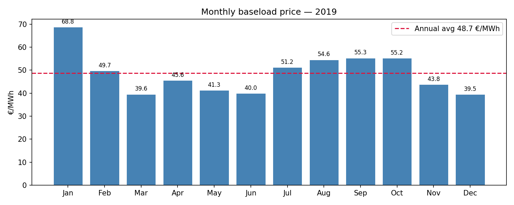

---

### 2.b: Peakload price, monthly

The **peakload price** is the volume-weighted average over peak hours only: **08:00–20:00, Monday–Friday** (12 hours/day × 5 days = 60 hours/week).

```python
df_peak = df.with_columns([
    pl.col("datetime_cet").dt.month().alias("month"),
    pl.col("datetime_cet").dt.hour().alias("hour"),
    pl.col("datetime_cet").dt.weekday().alias("weekday"),  # 1=Mon … 7=Sun
])

peak_mask = (
    (pl.col("hour") >= 8) & (pl.col("hour") <= 19) &
    (pl.col("weekday") <= 5)  # Mon–Fri
)

monthly_peakload = (
    df_peak
    .filter(peak_mask)
    .group_by("month")
    .agg(pl.col("price").mean().alias("peakload_€MWh"))
    .sort("month")
)
```

Peakload prices are consistently above their baseload counterparts each month, reflecting higher demand during business hours. The chart below shows both series side by side:

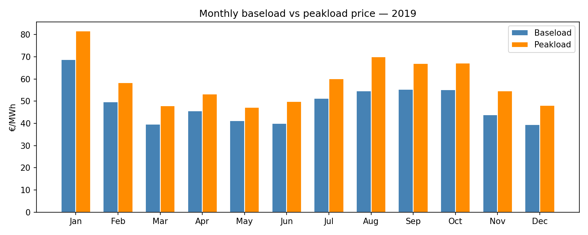

---

### 2.c: Total production per source and Consumer X consumption

Production columns (`solar`, `hydro`, `wind`, `nuclear`, `lignite`) are already in MWh. Consumer X is recorded in kWh and is converted to MWh for comparison.

**Annual totals 2019:**

| Source | Total [MWh] |
|---|---|
| Solar | 245,268 |
| Hydro | 4,309,297 |
| Wind | 4,636 |
| Nuclear | 5,499,420 |
| Lignite | 3,997,051 |
| Consumer X | 8,843 |

Nuclear is the dominant source, followed by hydro and lignite. Wind and solar contribute far less in this market. Consumer X draws a small 8.8 GWh over the year, roughly 0.06 % of total generation.

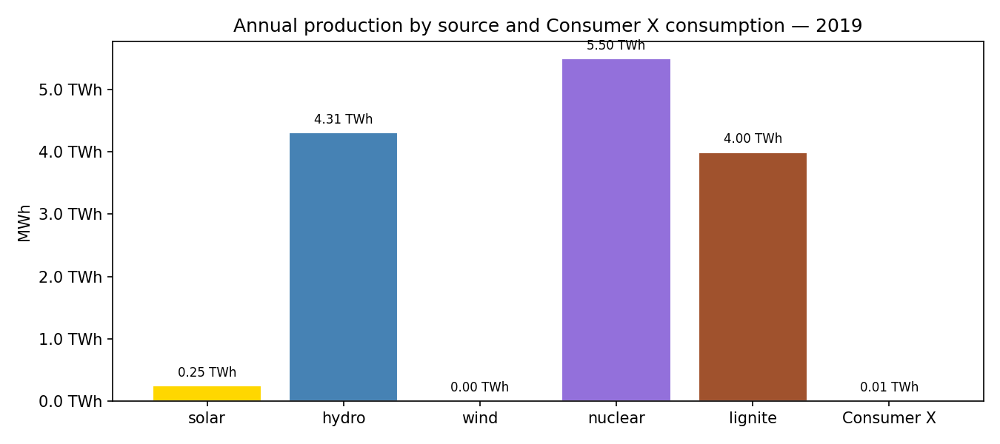

---

### 2.d: Average price value per source and Consumer X

The **value** of electricity is the volume-weighted average price — the spot price averaged over each hour, weighted by that hour's output (or consumption). This tells you what price a plant actually captured, not just what the market averaged.

All sources sit close to the baseload reference of 48.75 €/MWh. Lignite captures the highest value because it dispatches during expensive hours. Nuclear captures the least — it runs flat around the clock, including cheap overnight hours, pulling its average down. Solar and Consumer X both land above baseload, meaning solar generates (and Consumer X consumes) relatively more during higher-priced hours.

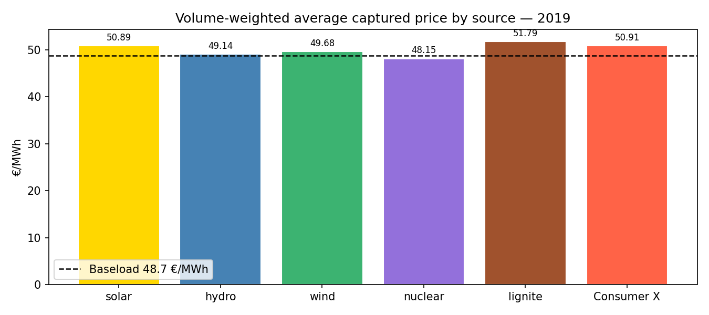

---

## Task 3: Price Scenarios

### 3.a: Expected value on 1.4.2020

The dataset contains 100 daily price scenarios from 17.1.2020 to 30.4.2020. The **expected value** on any given date is the simple arithmetic mean across all 100 scenarios for that day.

**Expected price on 1.4.2020: 48.14 €/MWh**

The top panel shows all 100 scenario paths fanning out over time, with the red line tracking the daily expected value. The bottom panel shows the distribution of scenario prices specifically on 1.4.2020 — the spread is wide (roughly 35–65 €/MWh), reflecting growing uncertainty further into the future.

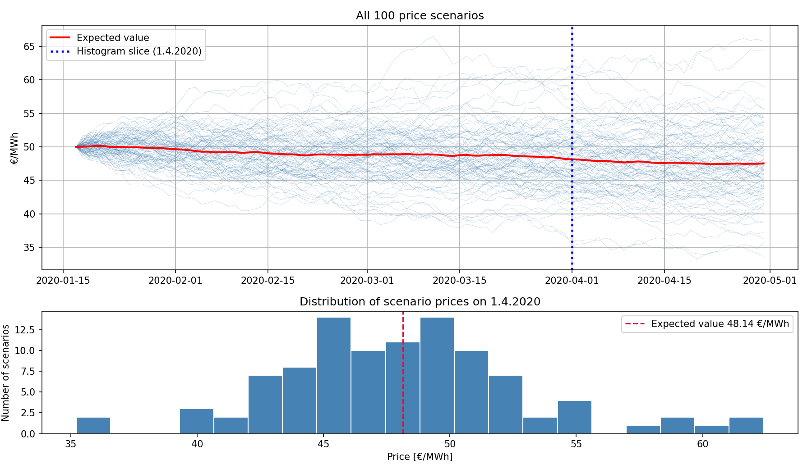

---

### 3.b: Algorithm profit in scenario #77

The algorithm has perfect next-day foresight and can hold at most 1 unit. The greedy strategy is: **buy** whenever tomorrow's price is higher than today's, **sell** whenever it is lower or equal. Any open position is closed on the last day.

**Scenario #77 total profit: 27.15 €/MWh**

The top panel shows the price path with buy (▲) and sell (▼) markers. The bottom panel tracks the mark-to-market cumulative P&L — it rises steadily and never dips below zero, since the algorithm only enters positions it knows will be profitable.

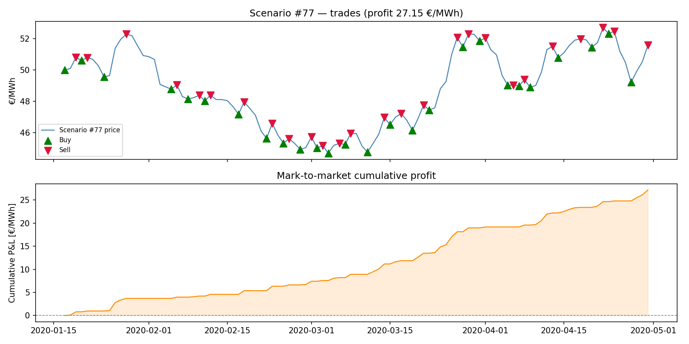

---

### 3.c: Profit across all 100 scenarios

Running the same algorithm on every scenario gives a profit distribution across all possible futures:

| | Profit [€/MWh] |
|---|---|
| Best scenario (Scenarij_48) | 39.87 |
| Mean across all scenarios | 24.09 |
| Worst scenario | 14.06 |

The left panel shows profits ranked from worst to best — the distribution is fairly smooth with no outliers on the downside, meaning the algorithm performs reasonably in every scenario. The right panel shows the best-case price path (Scenarij_48): prices trend strongly upward from ~50 to ~65 €/MWh, creating many profitable long positions.

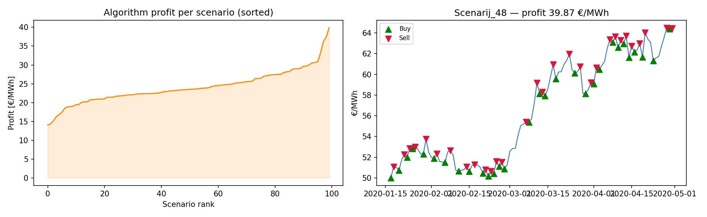

---

### 3.d: Value of the call option

A **European call option** gives the holder the right — but not the obligation — to buy electricity on 1.4.2020 at a fixed **strike price of 55 €/MWh**. The payoff at expiry is:

$$\text{payoff} = \max(0,\ P_{\text{1.4.2020}} - 55)$$

If the market price exceeds the strike the option is exercised and the holder profits by the difference. If the market price is below the strike the option expires worthless and the holder loses only the premium paid upfront.

The **fair value (premium)** of the option is the expected payoff under the 100 Monte Carlo scenarios — what a risk-neutral seller would charge so that neither buyer nor seller has a systematic edge:

```python
strike  = 55.0
payoffs = np.maximum(0, prices_apr1 - strike)
option_value = payoffs.mean()   # 0.31 €/MWh
```

**Results:**

| Metric | Value |
|---|---|
| Option value (fair premium) | **0.31 €/MWh** |
| In-the-money scenarios | **7 / 100** |
| Payoff range | 0.00 – 7.41 €/MWh |

The option is cheap because the expected price on 1.4.2020 is ~48 €/MWh — well below the 55 €/MWh strike. Only 7 out of 100 scenarios push above the strike, so most of the time the option expires worthless. Those 7 scenarios produce payoffs up to 7.41 €/MWh, pulling the average up from zero to 0.31 €/MWh.

The left panel shows the payoff distribution: the grey bar represents the 93 out-of-the-money scenarios (payoff = 0) and the orange bars show the small number of in-the-money payoffs. The right panel overlays the strike and expected price on the full price distribution for 1.4.2020, showing how far into the tail the strike sits.

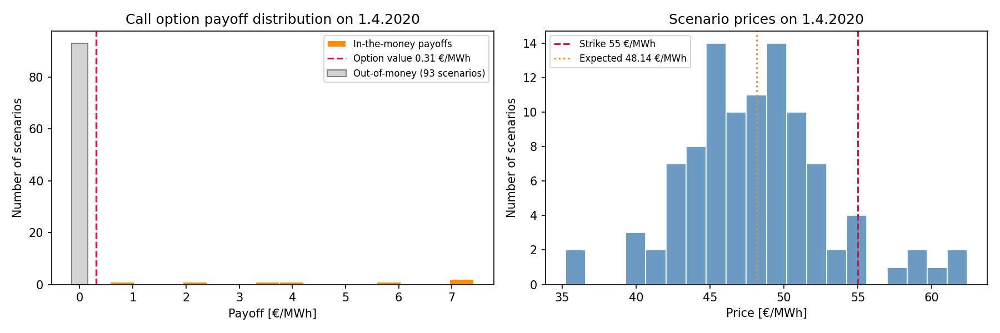
